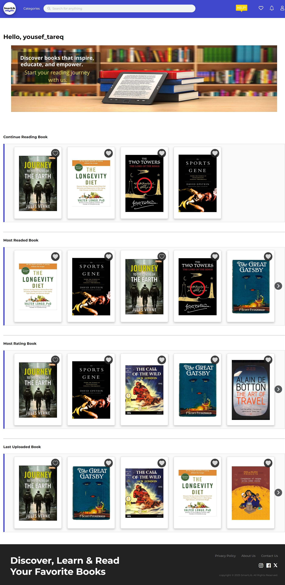

# SmartLib

## Description:
SmartLib makes it easier for readers to find, explore, and enjoy books like never before! By integrating suggestion system, gamification system, translate-text, text-to-speech, and text analysis, we aim to bridge the gap between technology and literature.

## Feature:

Key Features:
- 📖 Suggestion system – Get personalized book suggestion based on your preferences.
- 📝 Text Summaries – Get quick insights without reading full books.
- 🔊 Text-to-Speech – Listen to books.
- 🌍 Translation-Text – Read books in arabic languages.
- 🎁 Gamification system – Stay motivated with rewards and points.
- 🔑 JWT for authentication.

## Tools and Technology:

- 🔹 **For Frontend:**
  - HTML, CSS, and JavaScript.
- 🔹 **For Backend:**
  - Python (Django Framework).
  - RESTful API.
- 🔹 **For Database and Storage:**
  - PostgreSQL and ORM.
- 🔹 **Development and Collaboration Tools:**
  - GitHub – For version control and team collaboration.
  - Trello – For project management and task tracking.
  - Postman – For testing our RESTful API.

## Demo Video:

🎥 <a href="https://drive.google.com/file/d/1KMbr8_YAWa-eVOcinesvTErqP7CioEsr/view?usp=sharing" target="_blank">Watch the Demo</a>

## Image:

